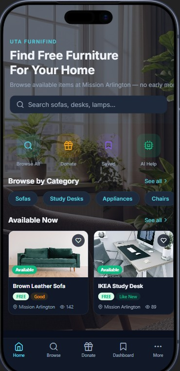
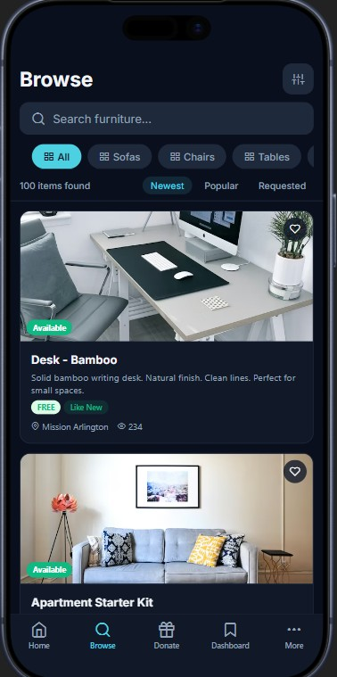
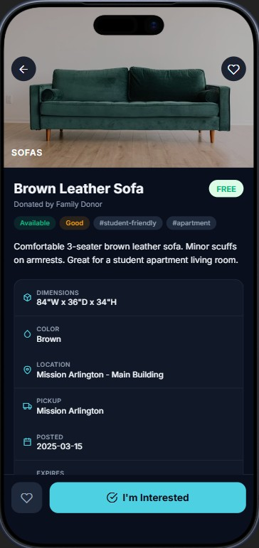
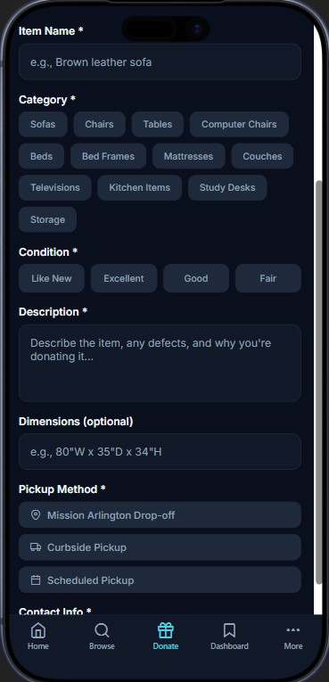
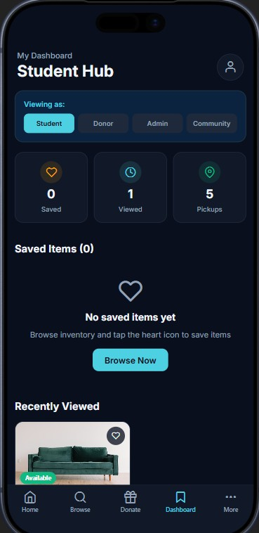
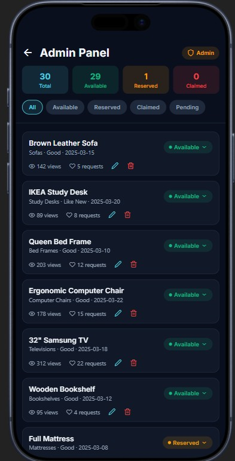
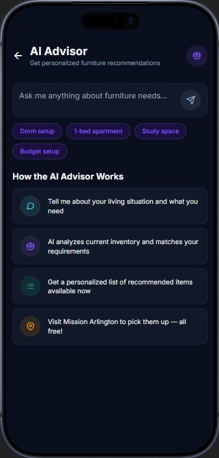

# UTA FurniFind

> **Free furniture, found fast.** A premium mobile app for University of Texas at Arlington students to browse and claim free furniture at Mission Arlington.

<div align="center">



[](https://expo.dev)
[](https://reactnative.dev)
[](https://www.typescriptlang.org)
[](LICENSE)

</div>

---

## About

UTA FurniFind connects UTA students with free furniture at **Mission Arlington** — a nonprofit that collects donated household items and makes them freely available to families and students in need. No fees, no early-bird queues, just show up and claim what you need.

Built with a premium dark-first UI using teal (`#4DD0E1`) and amber (`#F59E0B`) accents, the app puts 100 real inventory items at your fingertips with photo previews, smart search, and an AI advisor to help you furnish your space.

---

## Screenshots

<table>
  <tr>
    <td align="center">
      <br/>
      <sub><b>Home</b></sub>
    </td>
    <td align="center">
      <br/>
      <sub><b>Browse</b></sub>
    </td>
    <td align="center">
      <br/>
      <sub><b>Item Detail</b></sub>
    </td>
  </tr>
  <tr>
    <td align="center">
      <br/>
      <sub><b>Donate</b></sub>
    </td>
    <td align="center">
      <br/>
      <sub><b>Student Hub</b></sub>
    </td>
    <td align="center">
      <br/>
      <sub><b>Admin Panel</b></sub>
    </td>
  </tr>
  <tr>
    <td align="center" colspan="3">
      <br/>
      <sub><b>AI Furniture Advisor</b></sub>
    </td>
  </tr>
</table>

---

## Features

### For Students
- **100 real inventory items** across 15 furniture categories with curated Unsplash photography
- **Smart search & filtering** — search by name, filter by category, sort by newest / most popular / most requested
- **Item detail view** — photos, dimensions, condition, tags, donor info, and one-tap "I'm Interested" requests
- **Save / wishlist** — heart items to save them for later; they appear in your Student Hub
- **AI Furniture Advisor** — describe your living situation and get a tailored list of matching available items

### For Donors
- **Donation form** — submit furniture items with name, category, condition, description, dimensions, and contact info
- **Donation guidelines** built right in — no broken or hazardous items, large items require pickup scheduling

### For Admins
- **Admin Panel** — view all 100 items with status badges, view/request counts, and inline status controls
- **Filter by status** — Available, Reserved, Claimed, Pending — at a glance
- **Edit & remove controls** per listing

### Community
- **Student Hub / Dashboard** — role switcher (Student / Donor / Admin / Community), saved items, pickup history stats, pickup tips
- **Pickup tips** — best times, what to bring, how to reserve

---

## Tech Stack

| Layer | Technology |
|---|---|
| Framework | [Expo](https://expo.dev) SDK 53 (React Native) |
| Language | TypeScript 5 |
| Navigation | Expo Router v5 (file-based) |
| State | React Context + AsyncStorage |
| UI | Custom dark theme, Expo Vector Icons (Feather), Inter font |
| Images | Unsplash CDN (category-mapped, with local fallbacks) |
| Haptics | `expo-haptics` |
| Safe Area | `react-native-safe-area-context` |

---

## Project Structure

```
artifacts/uta-furnifind/
├── app/
│   ├── (tabs)/
│   │   ├── index.tsx          # Home screen
│   │   ├── browse.tsx         # Browse & search
│   │   ├── donate.tsx         # Donation form
│   │   ├── dashboard.tsx      # Student Hub
│   │   └── more.tsx           # More / settings
│   ├── item/[id].tsx          # Item detail
│   ├── ai-helper.tsx          # AI Furniture Advisor
│   ├── admin.tsx              # Admin panel
│   ├── community.tsx          # Community impact
│   ├── profile.tsx            # Profile screen
│   └── about.tsx              # About Mission Arlington
├── components/
│   ├── ItemCard.tsx           # Card with real photo + badges
│   ├── CategoryIcon.tsx       # Feather icon per category
│   ├── CategoryPills.tsx      # Scrollable filter pills
│   ├── SearchBar.tsx          # Search input component
│   └── ImpactStats.tsx        # Stats row component
├── constants/
│   ├── inventory.ts           # 100 dummy inventory records
│   └── categoryImages.ts      # Unsplash URLs per category
├── context/
│   └── AppContext.tsx         # Saves, requests, AsyncStorage
├── hooks/
│   └── useColors.ts           # Dark/light color tokens
└── screenshots/               # App screenshots for this README
```

---

## Getting Started

### Prerequisites

- Node.js 18+
- pnpm 9+
- Expo Go app on your phone (iOS or Android) **or** a simulator

### Install & Run

```bash
# From the monorepo root
pnpm install

# Start the Expo dev server
pnpm --filter @workspace/uta-furnifind run dev
```

Then scan the QR code with **Expo Go** or press `i` for iOS simulator / `a` for Android.

---

## Design System

| Token | Value | Usage |
|---|---|---|
| Primary (Teal) | `#4DD0E1` | Buttons, active tabs, links |
| Accent (Amber) | `#F59E0B` | Highlights, "Good" condition, warnings |
| Background | `#0a0f1e` | Deep navy app background |
| Card | `#111827` | Card surfaces |
| Success (Green) | `#10b981` | Available status, "Like New" condition |
| Danger (Red) | `#ef4444` | Claimed status, "Fair" condition |
| Font | Inter (400 / 600 / 700) | All text |

---

## Data

All 100 inventory items are local dummy data in `constants/inventory.ts` and persist via AsyncStorage. There is no backend — the app runs entirely offline after first load.

Item categories covered: Sofas, Chairs, Tables, Computer Chairs, Beds, Bed Frames, Mattresses, Couches, Televisions, Kitchen Items, Study Desks, Storage, Bookshelves, Lamps, and Miscellaneous.

---

## Mission Arlington

[Mission Arlington](https://www.missionarlington.org) is a nonprofit ministry that provides food, clothing, furniture, and other essentials to families in need throughout the Arlington, Texas area. UTA FurniFind is an unofficial student tool to help surface available furniture to students who need it most.

---

## License

MIT © 2025 UTA FurniFind Contributors
